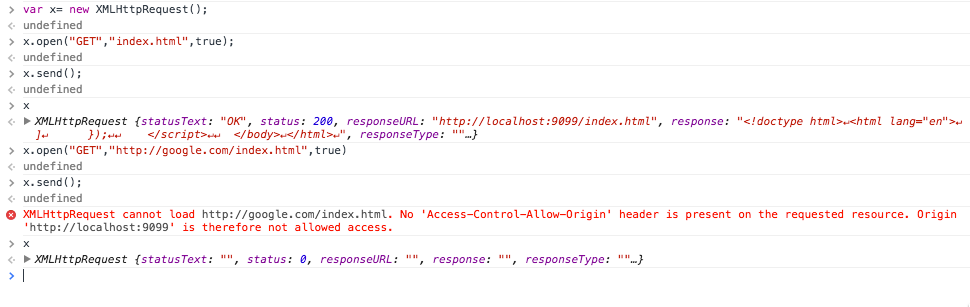
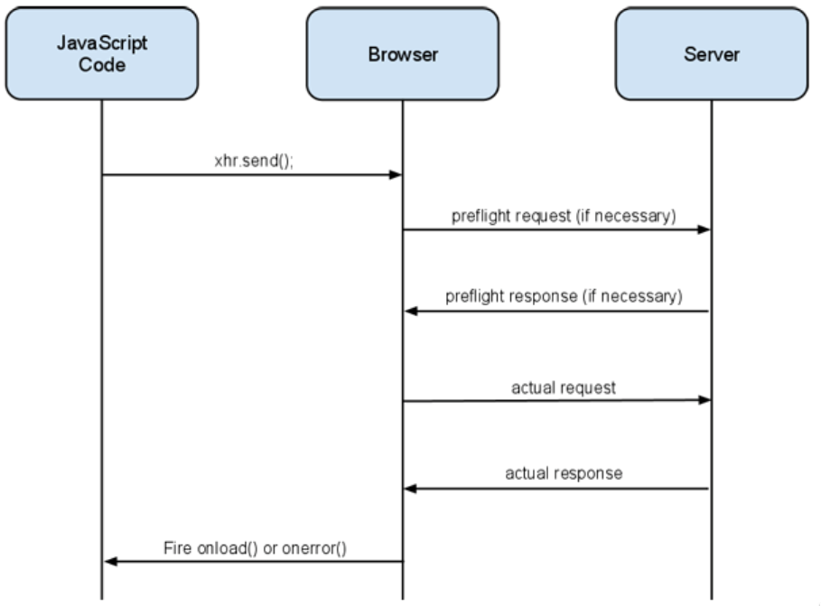

<!-- .slide: class="center" -->
# Attacking 
# XHR And CORS

--
<!-- .slide: class="center" -->
# XHR

### Xml HTTP Request

--

## Sample XHR Request

<pre>
function reqListener () {
  console.log(this.responseText);
}

var oReq = new XMLHttpRequest();
oReq.onload = reqListener;
oReq.open("get", "yourFile.txt", true);
oReq.send();
</pre>

* GET Request
* yourFile.txt is fetched
* true means its async call
* reqlistener is callback function

So XHR allows me to fetch content and get response too so what's the problem
--

## XHR Not a Silver Bullet 

	

Notes:
Show data transfer live on burp

--

## XHR meet CORS

* Cross Origin Resource Sharing
* Relax same origin policy and allow third party read

--

## Cross Origin Network Access
Origin is permitted to send data to another origin but not read

Interactions between origins are placed in three categories:

- Cross origin writes (redirects, links, form action etc.) 
- Cross origin embedding (html tag with src/hrefs)
- Cross origin reads (not allowed without CORS etc.)

--

# Cross Origin Embedding

* JavaScript &lt;script src="...">&lt;/script>.
* CSS with &lt;link rel="stylesheet" href="...">.
* Images with &lt;img>.
* Media files with &lt;video> and &lt;audio> tags.
* Plug-ins with &lt;object>, &lt;embed> and &lt;applet>. 
* Fonts with @font-face.
* Anything with &lt;frame> and &lt;iframe>.

--

## Cross Origin Policy

--

## Why is CORS needed?

* For legitimate and trusted requests to gain access to authorized data from other domains
* Think cross application data sharing models
* Allows data to be exchanged with trusted sites while using a relaxed Same Origin policy mode.
* Application APIs exposed via web services and trusted domains require CORS to be accessible over the SOP

--
## CORS – Simple Requests

* Preflight is not needed if
	* Request is a HEAD/GET/POST via XHR – No Custom headers
	* Body is text/plain
* Server responds with a CORS header
	* Browser determines access
	* Neither the request, nor response contain cookies

--

## CORS Headers – Simple Request
* Origin
	* Header set by the client for every CORS request
	* Value is the current domain that made the request
* Access-Control-Allow-Origin
	* Set by the server and used by the browser to determine if the response is to be allowed or not.
	* Can be set to * to make resources public (bad practice!)

--
## CORS – Requests with Preflight 
* Preflight requests are made if
	* Request is a method other than HEAD/GET/POST via XHR (PUT, DELETE etc.)
	* Custom headers are present (X-PINGBACK etc.)
	* Content-Type other than application/x-www- form-urlencoded, multipart/form-data, or text/plain
* A transparent request is made to the server requesting access information using OPTIONS

--

## Example from yesterday

<pre>
OPTIONS /usermail HTTP/1.1
Origin: mail.example.com
Content-Type: text/html
 
HTTP/1.0 200 OK
Access-Control-Allow-Origin: http://www.example.com, https://login.example.com
Access-Control-Allow-Methods: POST, GET, OPTIONS
Access-Control-Allow-Headers: X-Prototype-Version, X-Requested-With, Content-Type, Accept
Access-Control-Max-Age: 86400 Content-Type: text/html; charset=US-ASCII Connection: keep-alive
Content-Length: 0
</pre>

--

## Example: Custom Headers

<pre>
xmlhttp.open("POST","ajax_test.php",true);
xmlhttp.setRequestHeader("Content-type","application/x-www-form-urlencoded");
xmlhttp.send("fname=Henry&lname=Ford");
</pre>

--

## CORS – Requests with Preflight
* Browser sends
	* Origin header
	* Access-Control-Request-Method
	* Access-Control-Request-Headers – (Optional)
* Server sends set of CORS headers that the browser uses to determine if the actual request has to be made or not

--

## CORS Headers – Request with Preflight (Preflight Browser Request)
* Origin
	* Header set by the client for every CORS request
	* Value is the current domain that made the request
* Access-Control-Request-Method:
	* Set by the browser, along with Origin.
	* Value is the method that the request wants to use
* Access-Control-Request-Headers(Optional):
	* A comma separated list of the custom headers being used.

--

## CORS Headers – Request with Preflight (Preflight Server Response)
* Access-Control-Allow-Origin – Same as in Simple requests
* Access-Control-Allow-Methods:
	* a comma separated list of allowed methods
* Access-Control-Allow-Headers:
	* a comma separated list of headers that the server will
allow.
* Access-Control-Max-Age:
	* the amount of time in seconds that this preflight request should be cached for.

--

<!-- .slide: class="center" -->
## CORS InSecurities

--
## CORS Security - Universal Allow
* Setting the 'Access-Control-Allow-Origin' header to *
* Effectively turns the content into a public resource, allowing access from any domain
* Scenarios?
	* An attacker can steal data from an intranet site that has set this header to * by enticing a user to visit an attacker controlled site on the Internet.
	* 	An attacker can perform attacks on other remote apps via a victim’s browser when the victim navigates to an attacker controlled site.

--

## CORS – Access Control based on Origin
* The Origin header indicates that the request is from a particular domain, but does not guarantee it
* Spoofing the Origin header allows access to the page if access is based on this header
* Scenarios?
	* An attacker sets the Origin header to view sensitive
information that is restricted
	* Attacker uses cURL to set a custom origin header
<pre>
curl --header 'origin:http://someserver.com' http://myserver.com:90/demo/origin_spoof.php
</pre>
--

## CORS – Caching of Preflight responses
* The Access-Control-Max-Age header is set to a high value, allowing browsers to cache Preflight responses
* Caching the preflight response for longer duration can pose a security risk.
* If the COR access-control policy is changed on the server the browser would still follow the old policy available in the Preflight Result Cache

--

## CORS Security – Misplaced Trust

* Data exchange between two domains is based on trust
* If one of the servers involved in the exchange of data is compromised then the model of CORS is put at risk
* Scenarios?
	* An attacker can compromise site A and host malicious content knowing site B trusts the data that site A sends to site B via CORS request resulting in XSS and other attacks.
	* An attacker can compromise site B and use the exposed CORS functionality in site A to attack users in site A

--

## CSRF with CORS

* Server may process client request to change server side data while verifying that the Origin header was set
* An attacker can use the .withCredentials = “true” property of XHR to replay any cookies to the application on which the victim is logged in
* Scenarios?
	* An attacker sets the Origin header or uses a trusted site A to send a non idempotent request to site B
	* The victim who is logged into site B when he is viewing the trusted site A causes site B to create a user account without his knowledge via a CSRF attack

--

## Preventive Checks

* Have only one and non empty instance of the origin header,
* Have only one and non empty instance of the host header,
* The value of the origin header is present in a internal allowed domains list (white list). As we act before the step 2 of the CORS HTTP requests/responses exchange process, allowed domains list is yet provided to client,
* Cache IP of the sender for 1 hour. If the sender send one time a origin domain that is not in the white list then all is requests will return an HTTP 403 response (protract allowed domain guessing).

--

## More preventive Checks

* if its B2B then a strict IP filtering.
* Custom Permission set per origin can be configured at the application end. (might result in massive overhead for large application with varied origin's of access)