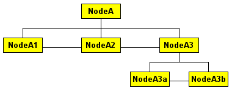

<!-- .slide: class="center" -->
# Exploiting 
# DOM

--
<!-- .slide: class="center" -->
# DOM

### Document Object Model

* interface that allows you to programmatically access and manipulate the contents of a web page (or document)
* It provides a structured, object-oriented representation of the individual elements and content in a page with methods for retrieving and setting the properties of those objects
* It also provides methods for adding and removing such objects, allowing you to create dynamic content
* Document is arranged in hierarchy of nodes.

--

### DOM Nodes

* NodeA.firstChild = NodeA1
* NodeA.lastChild = NodeA3
* NodeA.childNodes.length = 3
* NodeA.childNodes[0] = NodeA1
* NodeA1.nextSibling = NodeA2
* NodeA1.parentNode = NodeA
* NodeA3b.parentNode.parentNode = NodeA

--

### DOM Source

* Cookies
	* document.cookie
* Window Name
	* windows.name
* Everything taken from the URL
	* document.URL
	* document.URLUnencoded
	* document.location(.pathname|.href|.search|.hash)
	* window.location(.pathname|.href|.search|.hash)
* The Referrer
	* document.referrer

--

### Sinks
* HTML Element creator
 * innerHTML
 * outerHTML
 * document.write
* user input parsing
	* eval
	* execScript
	* function
	* setTimeout
	* setInterval
	* script.src
	* iframe.src
	* location.(replace|assign)

--

## What is DOMXSS

http://www.webappsec.org/projects/articles/071105.html

https://code.google.com/p/domxsswiki/wiki/Introduction

--

## How to Exploit DOMXSS

--

## How to Find DOM-XSS

Finding All Sources

<pre>
/(location\s*[\[.])|([.\[]\s*["']?\s*(arguments|dialogArguments|innerHTML|write(ln)?|open(Dialog)?|showModalDialog|cookie|URL|documentURI|baseURI|referrer|name|opener|parent|top|content|self|frames)\W)|(localStorage|sessionStorage|Database)/
</pre>

Finding Sinks
<pre>
/((src|href|data|location|code|value|action)\s*["'\]]*\s*\+?\s*=)|((replace|assign|navigate|getResponseHeader|open(Dialog)?|showModalDialog|eval|evaluate|execCommand|execScript|setTimeout|setInterval)\s*["'\]]*\s*\()/
</pre>

Finding Sink (Jquery)
<pre>
/after\(|\.append\(|\.before\(|\.html\(|\.prepend\(|\.replaceWith\(|\.wrap\(|\.wrapAll\(|\$\(|\.globalEval\(|\.add\(|jQUery\(|\$\(|\.parseHTML\(/
</pre>

--

## Useful Sources for DomXSS exploitation

* andlabs.org
* Domsnitch
* RA2
* Dominator