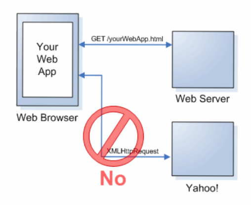

<!-- .slide: class="center" -->

# Application 
# Security Testing

--

# Who am i

* Anant Shrivastava
* Specialize in Web, Mobile and Linux Servers
* SANS GWAPT, RHCE, CEH
* Co-Author OWASP Testing Guide
* Project Lead 
	* Android Tamer
	* CodeVigilant

--

# Who are you

* Names or Nicknames
* What's your comfort level with HTML5
* What do you expect from This course

--
# Day 1

Understand the latest buzzwords in HTML5

* CORS
* JSON
* Newer HTML5 tags
* Local Storage and WebSQL
* DOM
* webworker
* Web API’s
* WebSockets
* iframe Sandboxing

Understand the general use cases around all HTML5 technologies.

--

# Day 1

## Hands On

* Write simple HTML5 based app/pages covering most of the above listed concepts. 
* This will allow participants to understand how technology is working and clear out the development related queries.

--

<!-- .slide: class="center" -->
# Basic Concepts

--

## HTML 5
* Created by Web Hypertext Application Technology Working Group (WHATWG) and W3C
* Next generation of HTML (now current generation)
* On 28 October 2014, HTML5 was released as a stable W3C Recommendation
* Limelight Point: Can eliminate flash from web
* Main attraction being interactive

--
<!-- .slide: class="center" -->
## new features of HTML 5

To understand this we will start with writing our own HTML5 pages.

<small>P.S.: The whole presentation is running on a HTML5 based framework.</small>

Notes: 
http://www.w3.org/TR/html5-diff/
--

### CORS

Cross origin resources sharing

Will be covered in detail tomorrow when we play with it fully.

Notes: Setup a server to show how cross origin sharing can work. expose server over network and then ask people to make ajax call.

--

### CORS OVERVIEW

Notes:
add details from riyaz's presentation

--

### WHAT IS ORIGIN

* http://127.0.0.1/index.html
* https://127.0.0.1/index.html
* http://127.0.0.1:8080/index.html
* http://127.0.0.1/testapp/index.html
* http://127.0.0.1:8080/testapp/index.html

--

## Purpose

* Relax Same Origin Policies 
* HTTP HEADER
	Access-Control-Allow-Origin <list of domain> or *
* Example
<pre>
OPTIONS /usermail HTTP/1.1
Origin: mail.example.com
Content-Type: text/html
 
HTTP/1.0 200 OK
Access-Control-Allow-Origin: http://www.example.com, https://login.example.com
Access-Control-Allow-Methods: POST, GET, OPTIONS
Access-Control-Allow-Headers: X-Prototype-Version, X-Requested-With, Content-Type, Accept
Access-Control-Max-Age: 86400 Content-Type: text/html; charset=US-ASCII Connection: keep-alive
Content-Length: 0
</pre>

--
<!-- .slide: class="center" -->
### JSON
#### JavaScript Object Notation

To be discussed in details when we do XHR and CORS tomorrow

Notes: 
Douglas Crockford and its funny license policy do no evil.

--
<!-- .slide: class="center" -->
### HTML tags

Many new tags added, many old tags updated

Notes:
# canvas
# webrtc
header
‣ section ‣ footer
‣ aside ‣ time
‣ nav ‣ summary
figure
diveintohtml5.info/semantics.html

--
<!-- .slide: class="center" -->
#### OLD
<pre>
&lt;!DOCTYPE html PUBLIC "-//W3C//DTD XHTML 1.0 Transitional//EN" 
"http:////www.w3.org/TR/xhtml1/DTD/xhtml1-transitional.dtd" &gt;
</pre>

--
<!-- .slide: class="center" -->
#### NEW
<pre>

&lt;!DOCTYPE html&gt;

</pre>

Notes:

did you know that it truthfully isn't even really necessary for HTML5? However, it's used for current, and older browsers that require a specified doctype. Browsers that do not understand this doctype will simply render the contained markup in standards mode. So, without worry, feel free to throw caution to the wind, and embrace the new HTML5 doctype

--
<!-- .slide: class="center" -->
## OLD 
<pre>

&lt;img src="path/to/image" alt="About image" /&gt;
&lt;p>Image of Mars. &lt;/p>

</pre>

--

<!-- .slide: class="center" -->
## NEW

<pre>
&lt;figure>
	&lt;img src="path/to/image" alt="About image" />
	&lt;figcaption>
		&lt;p>This is an image of something interesting. &lt;/p>
	&lt;/figcaption>
&lt;/figure>
</pre>

--
<!-- .slide: class="center" -->
## OLD 

<pre>
&lt;link rel="stylesheet" href="path/to/stylesheet.css" type="text/css" />
&lt;script type="text/javascript" src="path/to/script.js">&lt;/script>
</pre>

--

<!-- .slide: class="center" -->
## NEW
<pre>
&lt;link rel="stylesheet" href="path/to/stylesheet.css" />
&lt;script src="path/to/script.js">&lt;/script>
</pre>

--
## NEW

* elements such as 
	* Header
	* footer
	* article

Mainly cosmetic / flow element
--

<!-- .slide: class="center" -->
## HTML Elements 

--
<!-- .slide: class="center" -->
#### contenteditable
<pre>
&lt;ul contenteditable=true>
&lt;li>List item 1&lt;/li>
&lt;/ul>
</pre>

<ul contenteditable="true">
		<li>List item 1
</ul>

--
<!-- .slide: class="center" -->
#### input type

<pre>
&lt;form action="" method="get">
		&lt;label for="email">Email:&lt;/label>
		&lt;input id="email" name="email" type="email" />
		&lt;input id="date" name="date" type="date" />
		&lt;button type="submit"> Submit Form &lt;/button>
	&lt;/form>
</pre>

<form action="" method="get">
		<label for="email">Email:</label>
		<input id="email" name="email" type="email" />
 		<label for="date">Date:</label>
	<input id="date" name="date" type="date" />
		<button type="submit"> Submit Form </button>
	</form>

--
#### Various types defined

* tel 
* search 
* email 
* number 
* range
* date
* month
* time
* url
* pattern="[a-z]{3}[0-9]{3}" : 3 alphabet and 3 number

--
<!-- .slide: class="center" -->
#### placeholder
<pre>
&lt;input name="email" type="email" placeholder="username@website.com" />
</pre>

<input style="width: 300px;height:28px;" name="email" type="email" placeholder="username@website.com" />

--
<!-- .slide: class="center" -->
## MORE API's

--
#### GEO LOCATIONS
<pre>
navigator.geolocation.getCurrentPosition(success, error);
navigator.geolocation.watchCurrentPosition(success, error);
function success(position) {
   var lat = position.coords.latitude;
   var long = position.coords.longitude;
   ...
}
</pre>

--

## Local Storage

* With HTML5, web pages can store data locally within the user's browser.
* Earlier, this was done with cookies. 
* Web Storage is more secure and faster. 
* Data not included with every server request, but used ONLY when asked for. 
* It is also possible to store large amounts of data, without affecting the website's performance.
* The data is stored in key/value pairs, and a web page can only access data stored by itself
* All browsers today offering 5-10 MB of storage in every user’s browser.i.e., For each domain 5MB of local storage.

* **sessionStorage** similar to **localStorage** but only available in current browser session.

--

## Example

[Example Of Localstorage](examples/localstorage.html)

<pre>
&lt;ul id="present_textarea" contenteditable="true">
&lt;li>Test1&lt;/li>
&lt;/ul>
&lt;input type="button" id="clearall" value="clear Storage" >
&lt;script type="text/javascript">
document.addEventListener("DOMContentLoaded", function() {
console.log("Onload fired via DOMContent Loaded");
if (localStorage.getItem("text")){
console.log("text found");
	<b>document.getElementById("present_textarea").innerHTML = localStorage.getItem("text");</b>
}});
var textarea=document.getElementById("present_textarea");
var clearall=document.getElementById("clearall");
clearall.onclick=function(){
	console.log("onclick");
	<b>localStorage.clear();</b>
};
textarea.onblur=function(){
console.log("onblur");
<b>localStorage.setItem("text",document.getElementById("present_textarea").innerHTML);</b>
};
&lt;/script>
</pre>

--

#### What is Application Cache?
* HTML5 introduces application cache, which means that a web application is cached, and accessible without an internet connection.
* Application cache gives an application three advantages:

	* Offline browsing - users can use the application when they're
	* offline Speed - cached resources load faster
	* Reduced server load - the browser will only download updated/changed resources from the server

--
#### Example 
* Define in HTML page

<pre>
&lt;!DOCTYPE html>
&lt;html lang="en" manifest="cache.manifest">
</pre>

* cache.manifest (served with Content-Type: text/cache-manifest)
<pre>
CACHE MANIFEST
 # 2013-07-25
 
NETWORK:
data.php
 
FALLBACK:
/ /offline.html
 
CACHE:
/main/home
/main/app.js
/settings/home
/settings/app.js
http://myhost/logo.png
http://myhost/check.png
http://myhost/cross.png
</pre>
--
## App Cache – What to cache?
* Fonts
* Splash image
* App icon
* Entry page 
* Fallback bootstrap

Never Cache:

* CSS
* HTML
* Javascript
--
## DOM

Document Object model

P.S. To be discussed in detail tomorrow.
--

## Questions?

1. can DOM be used to add / delete elements?
1. is Cookie part of DOM or not?

--

## Web API’s

1. Audio
1. Video
1. SVG
1. and many more

--

## WebSockets

<pre>
GET /chat HTTP/1.1
Host: server.example.com
Upgrade: WebSocket
Connection: Upgrade
Sec-WebSocket-Key: dGhlIHNhbXBsZSBub25jZQ== 
Origin: http://example.com 
Sec-WebSocket-Protocol: chat, superchat 
Sec-WebSocket-Version: 13
</pre>

And on the server

<pre>
HTTP/1.1 101 Switching Protocols
Upgrade: WebSocket
Connection: Upgrade
Sec-WebSocket-Accept: s3pPLMBiTxaQ9kYGzzhZRbK+xOo= 
Sec-WebSocket-Protocol: chat
</pre>

--

## Websocket

* ws://
* wss://

--

## webworker

* When executing scripts in an HTML page, the page becomes unresponsive until the script is finished.

* A web worker is a JavaScript that runs in the background, independently of other scripts, without affecting the performance of the page. You can continue to do whatever you want: clicking, selecting things, etc., while the web worker runs in the background.

--

#### Server-Sent Events - One Way Messaging
* A server-sent event is when a web page automatically gets updates from a server.
* This was also possible before, but the web page would have to ask if any updates were available. With server-sent events, the updates come automatically.
* __Examples__: Facebook/Twitter updates, stock price updates, news feeds, sport results, etc.

--

<!-- .slide: class="center" -->
## iframe Sandboxing

--
## Javascript Frame busting 
<pre>
if( self == top ) {
document.documentElement.style.display = 'block' ;
} else {
top.location = self.location ;
}
</pre>

--
## Example Framebusting
[Open link]("examples/framebuster.html")
--
## Framebusting Bypass
<pre>
&lt;iframe sandbox src="/examples/framebuster.html" /> 
</pre>

<iframe sandbox src="/examples/framebuster.html" />

Notes:
Mitigation is possible with other means we will talk about it in details on day 3 and day 4
--

## Exercises 

1. Convert html4 to html5
2. write a program with following objectives
	1. webpage take input from user (use HTML5 validation where applicable)
		* Username
		* nickname
		* Full Name
		* Date of Birth
		* Email address
	1. store all of them in localstorage except his nickname which is stored in session storage, 
	2. and option to clear the storage
3. Iframe a content page which has framebusting javascript code.

--

## What we learned

1. How HTML5 differs from HTML4
1. How to convert HTML4 to HTML5
1. how to bypass framebusting code
1. How CORS work conceptually

--

## Day 2

1. Attacking CORS and XHR
1. Exploiting DOM
